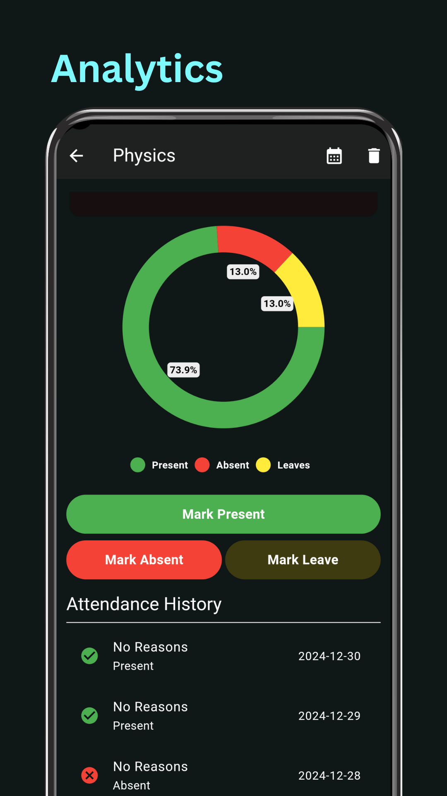
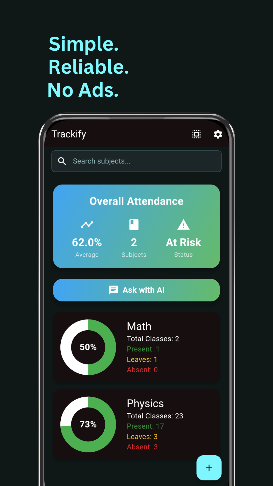
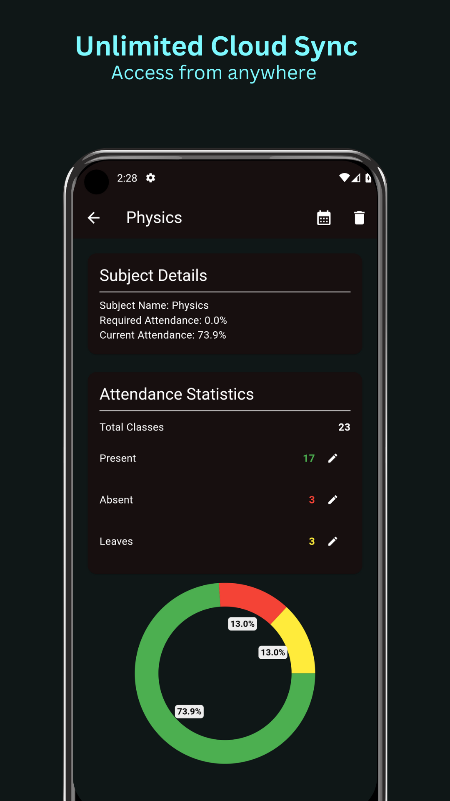
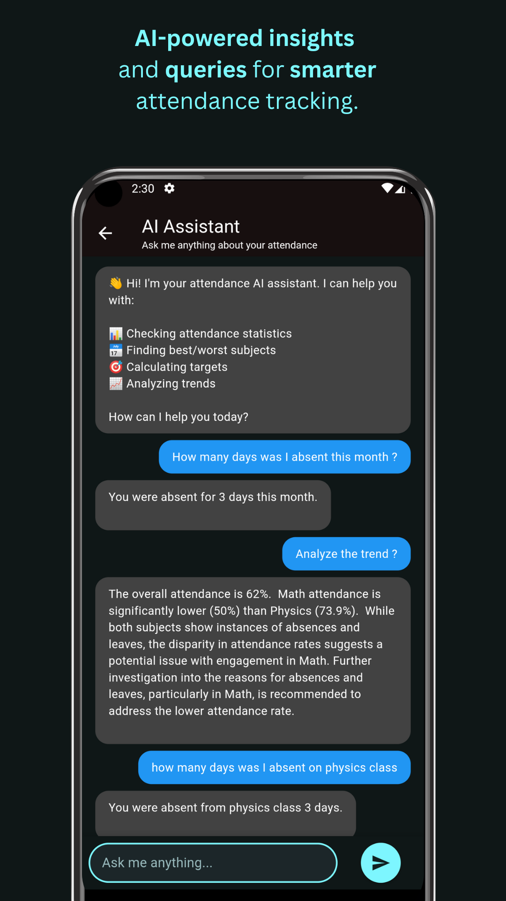
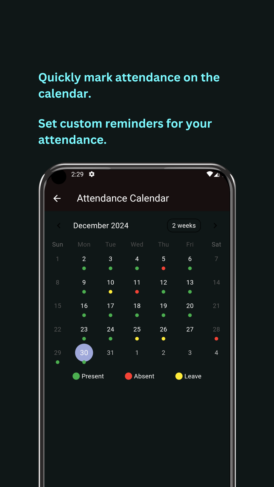

# Trackify - AI Attendance Tracker  

Trackify is a next-generation AI-powered attendance tracker built with **Gemini**, **Flutter**, **Firebase**, and **RevenueCat**. It simplifies attendance management by enabling natural language queries and leveraging advanced machine learning for seamless operation across educational institutions, workplaces, and events.  

## Features  

- **AI-Powered Natural Language Query**: Powered by Gemini, enabling users to ask questions like "Who was absent last week?" or "What is the attendance rate for today?"  
- **Cross-Platform Compatibility**: Built with Flutter to ensure a smooth experience on Android, iOS, and the web.  
- **Authentication**: Secure and scalable authentication powered by Firebase.  
- **Cloud-Based Storage**: Attendance data is securely stored and managed using Firebase's Realtime Database or Firestore.  
- **In-App Purchases**: Monetized with **RevenueCat**, offering premium features like advanced analytics and custom reports.  
- **Customizable Groups**: Manage attendance for classes, teams, or departments effortlessly.  
- **Insights & Reporting**: Generate detailed attendance reports in PDF or Excel formats.

## Screenshots  

<div style="display: flex; flex-wrap: nowrap; gap: 10px;">
  
  
  
  
  
</div>


## Tech Stack  

- **Frontend**: Flutter  
- **Natural Language Processing**: Gemini for AI-powered natural language queries  
- **Backend**: Firebase (Authentication, Database Storage)  
- **In-App Purchases**: RevenueCat for IAP management  

## Installation  

1. Clone the repository:  
   ```bash  
   git clone https://github.com/saquibjawedbit/trackify.git  
   cd trackify
   ```
2. Install dependencies:  
   ```bash
   flutter pub get
   ```
